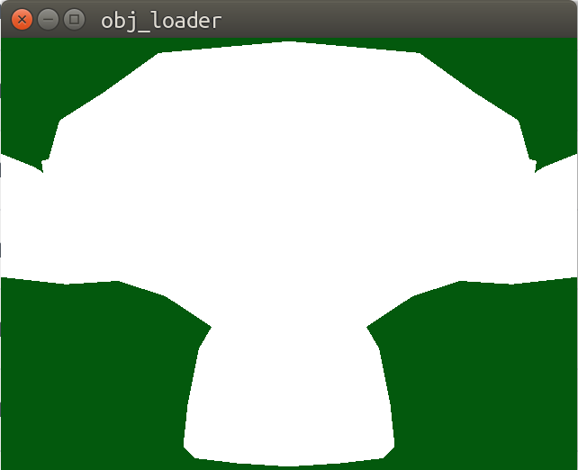
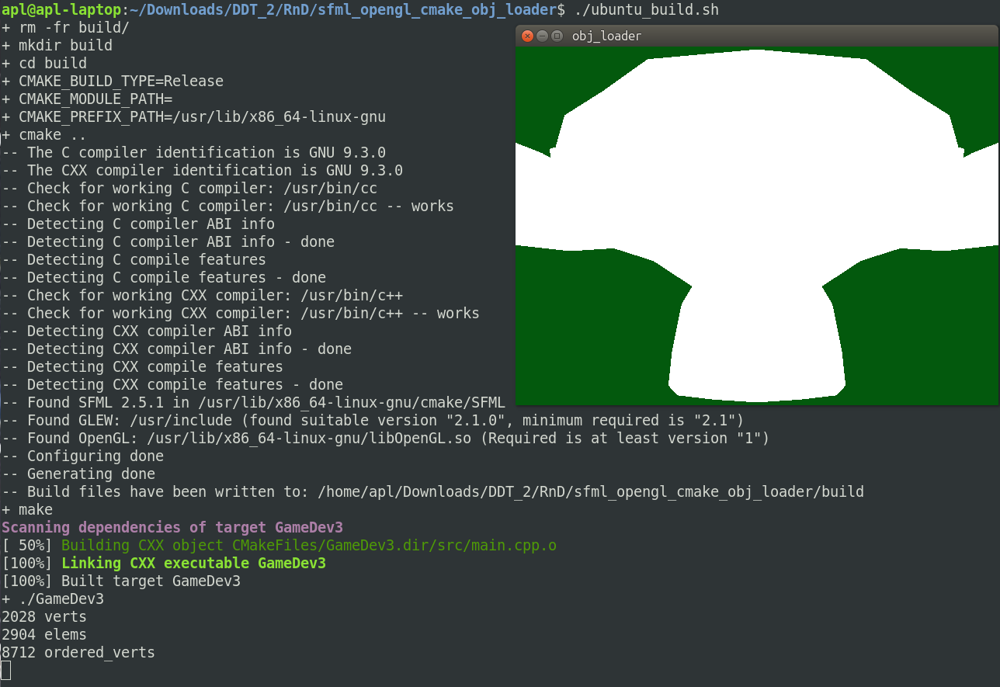

Simple project to load object (OBJ) data into an SFML application.  
==================================================================  

# Screenshot of Final Application  
  

# Required Shared Libraries:  
`OpenGL` (libgl1-mesa-dev ...) `GLEW` (libglew-dev) `SFML` (libsfml-dev)  

# Toolchain  
`g++ 9.3.0`  

# Build  
  

# Additional info  

## OpenGL  
- https://www.khronos.org/opengl/wiki/Getting_Started#Linux  
- https://www.khronos.org/opengl/wiki/Platform_specifics:_Linux  

## SFML  
- https://www.sfml-dev.org/  

## CMake  
- https://cmake.org/cmake/help/latest  
